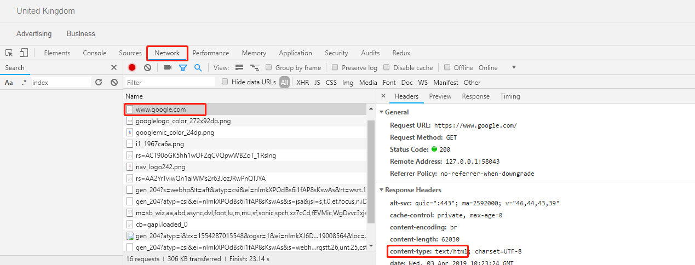

# 读书笔记 —— 《HTTP 权威指南》

## 一、前言

---

​	有的人会将自己的认知或经历写成一篇文章甚至一本书，而我，却因为一次经历去阅读别人的作品。记得在很久以前面试前端职位的时候给人问个一个问题：什么是 HTTP 协议 。而当时年时无知的我只能简单的答上一句：超文本传输协议。后来回想，面对这样的问题或许我应该能回答的更好，其实很多知识在脑海里面是存在的，但是却是零散的，所以，也是时候将它们组织起来的，这就是我阅读本书的缘由。希望通过这次阅读，以后谁再问这样的问题我就能给你扯上几个小时。

## 二、HTTP 概述

---

### 1. 什么是 HTTP 

​	`HTTP` 是 `Hypertext Transfer Protocol` 的缩写，翻译为超文本传输协议，是在万维网上进行通信时所使用的协议方案。`HTTP` 有很多应用，但是最著名的是用于 `Web` 浏览器和 `Web` 服务器之间的通信。然而，`Web` 资源的是存储在 `Web` 服务器上的，`Web` 服务器所使用的是 `HTTP` 协议，因此，这些服务器也被称为 `HTTP` 服务器。

### 2. 资源

​	在前面提到了一个词 `Web` 资源，有必要解析一下：最简单的 `Web` 资源就是服务器中的静态文件，比如，文本文件、HTML文件（网页）、JPG图片等等，但是不仅仅包括这些，还包括动态的资源，比如，程序。总之，所有类型的内容来源都是资源。

### 3. MIME类型

​	从前面知道，因特网上资源的种类是很多的，`HTTP` 服务器会为所有的 `HTTP` 对象数据（资源）附加上一个 `MIME` 类型，这个类型是用于描述资源的具体类型的，浏览器也会根据这个类型对不同的资源做出不同的处理。

​	**`MIME` 类型是一种文本标记，表示一种主要的对象类型和一个特定的子类型，中间由一条斜杠来分隔。** 举个例子：

打开谷歌官网，然后通过开发者工具找到这个网页的 `HTML` 文件，找到响应头信息：

`text/html` 就是一个 `MIME` 类型。

### 4. URI 与 URL

​	每个 `Web` 服务器资源除了有一个 `MIME` 类型以外，还有一个 “地址”，这样客户端就可以说明它们想要哪个资源了。然而这个地址就是 `URI (Uniform Resource Identifier)` ，意为统一资源标识符，它就像生活中的地址一样，通过一个具体的地址我们就可以找到一个具体的方法了。 `URI` 也正是如此，在世界范围内唯一标识并且定位信息资源。`URI` 有两种形式，分别称为 `URL` 和 `URN` 。

​	`URL` ，统一资源定位符，是资源标识符最常见的形式。`URL` 描述了一台特定服务器上某资源的特定位置。大部分 `URL` 都遵循一种标准格式：

- 方案，说明了访问资源所使用的协议类型。（常见的就是 `HTTP` 协议 ）
- 服务器的因特网地址
- 其他部分指的是这个 `Web` 服务器上的某个资源

​	现实中几乎所有的 `URI` 都是 `URL`，所以这里就不介绍 `URN` 了。当然，`URL` 也不止这点东西，在此只是简单的介绍，后面的章节再来详细讨论。

### 5. 事务

​	一个 `HTTP` 事务由一条请求命令（由客户端发往服务器）和一个响应结果（从服务器发回客户端）组成的。这种通信时通过 `HTTP` 报文的格式化数据块进行的。

#### i. 方法

`HTTP` 支持几种不同的请求命令，这些命令被称为 `HTTP` 方法，每条 `HTTP` 请求报文都包含一个方法，这个方法的作用就是告诉服务器要干嘛，是拿一个资源呢，还是删除一个资源或者其他操作呢。常见的 `HTTP` 方法有：GET、POST、PUT、DELETE 分别表示查询，增加，修改和删除（REST）。

#### ii. 状态码

每条 `HTTP` 响应报文返回时都会携带一个状态码，以告诉客户端请求的处理状况。

通常 2开头的表示成功；3开头的表示重定向；4开头的代表客户端出错；5开头的代表服务器端出错。（在后面再详细介绍）

### 6. 报文

`HTTP` 报文是由一行一行的简单字符串组成的，`HTTP` 报文包括起始行、首部字段和主体。详细的内容在后面章节介绍。

## 三、URL

---

### 1. URL 语法

`URL` 提供了一种定位因特网上任意资源的手段，但这些资源是可以通过各种不同的方案（方案的概念在前面已经提到过，比如 `HTTP` 、`FTP` 等）来访问的，因此 `URL` 语法会随方案不同而有所不同。这是不是意味着每种不同的 `URL` 方案都会有完全不同的语法呢？其实不是的。大部分 `URL` 都遵循通用的 `URL` 语法，而且不同 `URL` 方案的风格和语法都有不少重叠。大多数 `URL` 语法都建立在这个由 9 个部分组成的通用格式上：

**`<scheme>://<user>:<password>@<host>:<port>/<path>;<params>?<query>#<frag>`** 但是不一定都包含这些组件，最重要的还是在前面提到过的三部分 方案（`scheme`）、主机（`host`）和路径（`path`）。但是抱着学习的心态还是来详细的看看所有的组件：

1. 方案 （`scheme`），表示访问服务器时使用哪种协议。
2. 用户（`user`），某些方案访问资源时需要用户名，默认值为匿名。
3. 密码（`password`），用户名后面可能要包含密码，中间由 ：分隔。
4. 主机（`host`），资源宿主服务器的主机名或 IP 地址。
5. 端口（`port`），资源宿主服务器正在监听的端口号，很多方案都有默认端口号，`HTTP` 的默认端口号是 80。
6. 路径（`path`），服务器上资源的本地名，由一个 / 将其与前面的 `URL` 组件分隔开。路径组件的语法是与服务器和方案有关的。
7. 参数（`params`），某些方案会用这个组件来指定输入参数，使用 ；相隔。
8. 查询（`query`），某些方案会用这个组件传递参数，比如 `HTTP` 协议中的 `GET` 请求。
9. 片段（`frag`），一小片或一部分资源的名字，这个字段不会传送给服务器，而是在客户端内部使用的，通过 # 将其与其他部分分隔。

### 2.方案

方案是规定如何访问指定资源的主要标识符，它会告诉负责解析 `URL` 的应用程序使用什么协议。方案组件必须以一个字母开头，由 ：结束，忽略大小写。、

### 3.用户名和密码

在因特网上并不是所有的资源都是公开的，有些资源是私有的，只有资源的管理者才能访问，所有，用户名和密码也就有了意义。有些服务器要求输入用户名和密码才允许用户访问数据，`FTP` 服务器就是这样的一个实例。

### 4. 主机与端口

要想在因特网上找到资源，应用程序要知道哪台服务器装载了资源以及在这台服务器上的什么地方可以找到这个资源。然而，`URL` 的主机和端口组件提供了这两组信息。

主机标识了因特网上能够访问资源的宿主服务器，可以使用主机名或 IP 地址来表示主机名。

端口标识了服务器正在监听的网络端口。

### 5. 路径

`URL` 的路径组件说明了资源位于服务器的什么地方，通常很像一个分级的文件系统路径。

### 6. 参数

对于很多方案来说，只有简单的主机名和到达对象的路径是不够的，除了服务器正在监听的端口，以及是否能够通过用户名和密码访问资源外，很多协议都还需要更多的信息才能工作。负责解析 `URL` 的应用程序需要这些协议参数来访问资源。否则，另一端的服务器可能就不会为请求提供服务。为了向应用程序提供它们所需要的输入参数，以便正确地与服务器进行通信， 参数组件就起到作用了。

参数这个组件其实就是一个名值对列表，由 ； 将其他部分分隔。比如： `ftp://prep.ai.mit.edu/pub/gnu;type=d` 就有一个参数 `type` ，值为 d

### 7. 查询字符串

这个组件就比较常见了，在 `HTTP` 协议中，通过 ？以及后面的内容表示一个查询字符串，作用就是发送 `GET` 请求并且将查询字符串中的参数作为请求参数带到服务器中。语法：? key=value&key=value ...

### 8. 片段

这个组件其实也是比较常见的，通常使用在一些篇幅比较长的页面，比如说某个框架的 API 文档，那内容肯定是非常详细的，通过会有一些分章节或者分类的导航链接，然而我们点击这些导航链接就会跳到页面的特定位置，这就是资源的一个片段。这是通过 `HTML` 中的 a 元素的锚点特性实现的。

## 四、HTTP 报文

---

如果说 `HTTP` 是因特网的信使，那么 `HTTP` 报文就是它用来搬东西的包裹了。专业一点描述 `HTTP` 报文就是在 `HTTP` 应用程序之间发送的数据块。这些数据块以一些文本形式的元信息开头，这些信息描述了报文的内容以及含义，后面跟着可选的数据部分。

### 1. 报文流

`HTTP` 使用术语 流入 和 流出 来描述事务的方向。报文流入源端服务器，工作完成以后，会流回用户的 Agent 代理中。不管是请求报文还是响应报文，都会向下游流动。所有报文的发送者都在接收者的上游。

### 2. 报文的语法

`HTTP` 报文可以分为两类：**请求报文和响应报文**。**请求报文会向服务器请求一个动作，而响应报文会将请求的结果返回给客户端。请求报文和响应报文的结构基本相同。**

- 请求报文的格式：

  方法名 请求URL 协议版本  （起始行）

  请求头  （首部）

  （空行）

  请求体（可选）

- 响应报文的格式：

  版本 状态码 原因短语  （起始行）

  响应头  （首部）

  （空行）

  响应体  （主体）

### 3. 报文的组成部分

`HTTP` 报文是简单的格式化数据块。它们由三部分组成：**起始行（对报文进行描述）、首部（包含一些属性）、主体（可选的，包含一些数据）**。

#### i. 起始行

**所有的 `HTTP` 报文都会以一个起始行作为开始，请求报文的起始行说明了要做什么，响应报文的起始行说明发生了什么。**

对于请求报文而言，起始行又称为请求行，包含了一个方法、一个请求URL 和 协议的版本号 。方法描述了服务器应该执行什么操作；请求URL描述了要对哪个资源执行这个方法；版本号用于告知服务器使用哪个版本的协议。

对于响应报文而言，起始行又称为响应行，包含了使用的 `HTTP` 版本号、状态码 和 原因短语（状态码的文本描述）。

#### ii. 首部

`HTTP` 首部的作用是向请求和响应报文中条件了一些附加信息，从本质上说，它们只是一些 K：V 。首部和方法共同决定了客服端和服务器能做什么事情。首部可分为以下的几种：

- 通用首部

  请求报文和响应报文都可以使用的首部。

  - `Date` ，提供日期和时间的标志，说明报文是什么时间创建的。
  - `Connection` ，允许客户端和服务器指定与请求/响应连接有关的选项。
  - `MIME-Version` ，给出了发送端使用的 `MIME` 版本。
  - `Cache-Control` ，用于随报文传送缓存指令。

- 请求首部

  用于请求报文。

  - `Host` ，给出了接收请求的服务器的主机名和端口号。
  - `Accept` ，告诉服务器能够发送哪些媒体类型。
  - `User-Agent` ，将发起请求的应用程序名称告知服务器。
  - `Referer` ，提供了包含当前请求 URI 的文档的 URL。
  - `From` ，提供了客户端用户的 `E-mail` 地址。

- 响应首部

  用于响应报文。

  - `Accept-Ranges` ，对此资源来说，服务器可接受的范围类型。
  - `Server` ，服务器应用程序软件的名称和版本。
  - `Set-Cookie` ，在客户端设置一个令牌，以便服务器对客户端进行标识。

- 实体首部

  提供了有关实体以及内容的信息。

  - `Content-Encoding` ，对主体执行的编码方式。
  - `Allow` ，列出了可以对此主体执行的请求方法。

#### iii. 主体

主体是可选的，它是报文要传输的内容，可以承载很多类型的数据：图片、视频、HTML 文档、应用程序等。